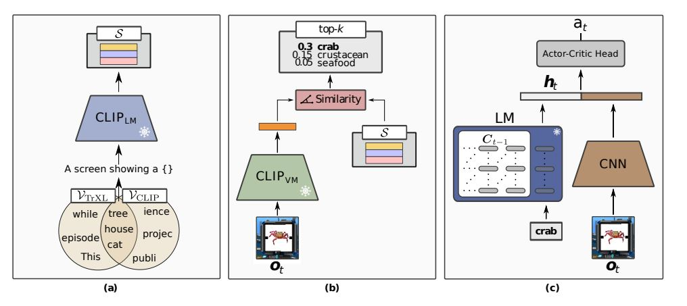
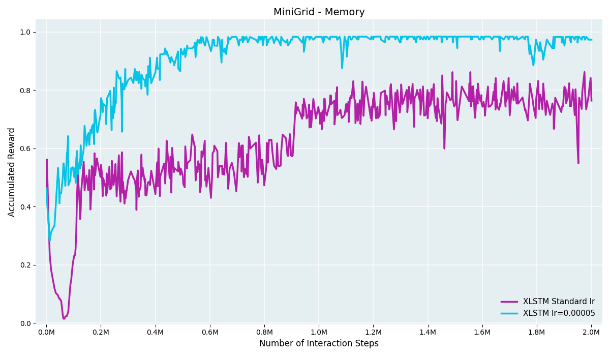
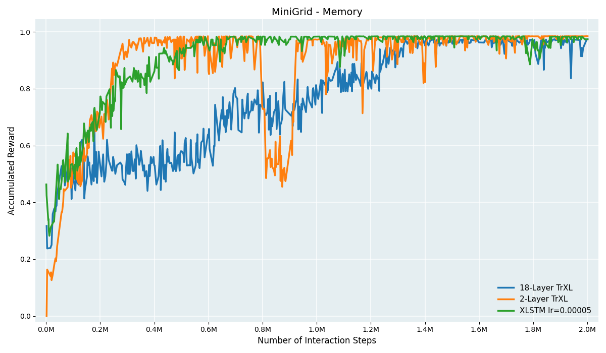

# xLSTM-SHELM: Integrating Extended Long Short-Term Memory into Semantic History Compression

This repository contains the code and final Bachelor Thesis for the project **"Integrating xLSTM into SHELM"** by Christian Kühberger.

<p align="center">
  
</p>

## Overview

Reinforcement Learning (RL) agents face significant challenges in Partially Observable Markov Decision Processes (POMDPs). To address this, **Semantic History Compression (SHELM)** utilizes a pretrained language model as an episodic memory. The original SHELM architecture relied on a Transformer-XL (TrXL) memory module.

In this thesis, we replace the TrXL with the newly introduced **Extended Long Short-Term Memory (xLSTM)**. xLSTM promises linear scaling with sequence length while maintaining the performance of Transformers. This repository provides the implementation of the xLSTM integration, stability improvements, and benchmarking against the original TrXL baseline.

**📄 Read the full thesis here:** [`26SS-K11919229-Kühberger_Christian-Thesis_BSc-xLSTM_SHELM.pdf`](./26SS-K11919229-Kühberger_Christian-Thesis_BSc-xLSTM_SHELM.pdf)

## Key Results

Our findings indicate that xLSTM achieves **over 3.3× faster inference** compared to the 18-layer TrXL baseline. However, scaling parameter counts to match large Transformers revealed stability challenges during fine-tuning, requiring careful hyperparameter adjustments, specifically lower learning rates, to prevent divergence.

<p align="center">
  
  
</p>

## Repository Structure

- `benchmark_inference.py`: Standalone script to benchmark the forward-pass inference speed of xLSTM against the TrXL baseline.
- `xlstm_adapter.py`: The core adapter layer that wraps the `xLSTM` implementation to match the expected inputs/outputs of the original SHELM pipeline.
- `experiment.py` / `model.py`: Updated to route inputs seamlessly through the xLSTM architecture.
- `trainers/shelm_trainer.py`: Modified training loop for stability adjustments.
- `figures/`: Contains all visualizations and charts used in the thesis.

## Setup & Installation

1. Clone this repository.
2. Install the conda environment:
   ```bash
   conda env create -f env.yml
   conda activate helm
   ```
3. (Optional) For WSL users, follow standard procedures to install `xvfb` and `sdl2` for headless rendering.

## Running the Code

### Benchmarking
To run the inference speed comparison between xLSTM and TrXL:
```bash
python benchmark_inference.py
```

### Training
To run an experiment using the xLSTM model on the Psychlab environment:
```bash
python experiment.py --var model=SHELM --var env=psychlab_continuous_recognition
```
*(Ensure you have the required datasets downloaded into `data/brady_konkle_oliva2008` as per the original SHELM instructions).*

---

## Acknowledgments

This project builds upon the original **SHELM** framework:
- *Paischer, F., Adler, T., Hofmarcher, M., & Hochreiter, S. (2023). Semantic HELM: An Interpretable Memory for Reinforcement Learning.* [arXiv:2306.09312](https://arxiv.org/abs/2306.09312)

The xLSTM integration utilizes the architecture from:
- *Beck, M., Pöppel, K., Spanring, M., Auer, A., Prudnikova, O., Kopp, M., ... & Hochreiter, S. (2024). xLSTM: Extended Long Short-Term Memory.* [arXiv:2405.04517](https://arxiv.org/abs/2405.04517)
